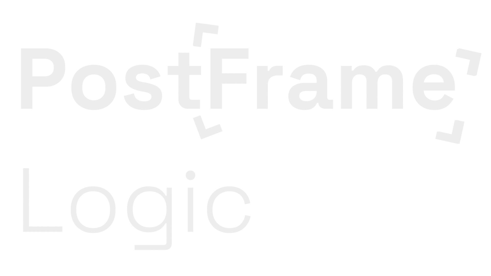

<p align="center">
  
</p>

## A tool that provides several modes for working with graphics (and video, but in the future) in real time.

> [!WARNING]
> The program uses real-time Path Tracing rendering, make sure that your computer is not a grandfather yet.

**There is almost nothing in the project, soon (maybe) there will be something useful.**

# Minimum specifications
- Processor better than potatoe
- 8GB of RAM
- Graphics card with at least Turing architecture (I'm serious, the rendering of this program will work terribly on older graphics cards.)

# Quickstart
Download or clone the repository
```bash
# Clone the repository
git clone --recursive https://github.com/dataphlab/postframe-logic.git
cd postframe-logic

# Build
cmake -B build
cmake --build build

# Run!
./build/postframe-logic
```

> [!WARNING]
> On a laptop with discrete graphics, use:
```bash
# Run!
prime-run ./build/postframe-logic
```

# What is planned to be done? (Up to version 0.1)
✔ - Done
✗ - Not started
— Work in progress
- Base Engine ✔
- Path Tracing ✔
- GLTF/GLB models support ✔
- Texture support —
- Max code optimization —
- Light System ✔
- Render to Video Mode ✗